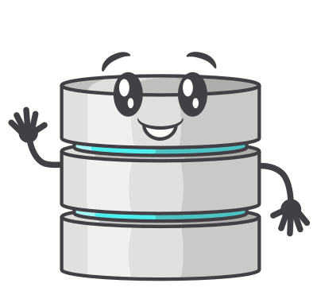

# canhazdb-server

[](https://github.com/canhazdb/server/blob/master/package.json)
[](https://github.com/canhazdb/server/blob/master/LICENSE)
[](https://github.com/standard/semistandard)

An embedable or standalone database, that shardes data across a cluster of nodes, with eventing.

## Getting Started
You must have a minimum version of Node 16 installed.

Create the tls files you need to secure your cluster.

A bash script `./makeCerts.sh` provided will create a folder with test certs you can use.

You can opt out of tls by omitting the tls option from canhazdb.

### Server Via Docker
The quickest way to setup a test server is via:
```bash
docker run -itp 8060:8060 canhazdb/server --single
```

Then visit http://localhost:8080

But you can create a production ready and scalable stack by
using the [stack.yml](stack.yml) file as an example.

This will give you TLS authenication and encryption along with
persistent storage.

### Server Via the CLI
```bash
npm install --global canhazdb-server
```

#### Create a single node server
```bash
canhazdb-server \
         --host localhost \
         --port 7061 \
         --data-dir ./canhazdb/one \
         --tls-ca ./certs/ca.cert.pem \
         --tls-cert ./certs/localhost.cert.pem \
         --tls-key ./certs/localhost.privkey.pem
```

#### Add some more to the cluster
```bash
canhazdb-server \
         --host localhost \
         --port 7062 \
         --data-dir ./canhazdb/two \
         --tls-ca ./certs/ca.cert.pem \
         --tls-cert ./certs/localhost.cert.pem \
         --tls-key ./certs/localhost.privkey.pem \
         --join localhost:7061

canhazdb-server \
         --host localhost \
         --port 7063 \
         --data-dir ./canhazdb/three \
         --tls-ca ./certs/ca.cert.pem \
         --tls-cert ./certs/localhost.cert.pem \
         --tls-key ./certs/localhost.privkey.pem \
         --join localhost:7061
```

### Server Via NodeJS
```bash
npm install --save canhazdb-server canhazdb-client
```

```javascript
const fs = require('fs');
const createServer = require('canhazdb-server');
const createClient = require('canhazdb-client');

async function main () {
  const tls = {
    key: fs.readFileSync('./certs/localhost.privkey.pem'),
    cert: fs.readFileSync('./certs/localhost.cert.pem'),
    ca: [ fs.readFileSync('./certs/ca.cert.pem') ],
    requestCert: true /* this denys any cert not signed with our ca above */
  };

  const node1 = await createServer({
    host: 'localhost',
    port: 7061,
    dataDirectory: './canhazdata/one',
    tls
  });

  const node2 = await createServer({
    host: 'localhost',
    port: 7062,
    dataDirectory: './canhazdata/two',
    tls, join: ['localhost:7061']
  });

  // You can join to other nodes after starting:
  // await node2.join({ host: 'otherhost', port: 8060 })

  const db = await createClient({ host: 'localhost', port: 8060, ...tls });
  const postedDocument = await db.post('tests', {
    a: 1,
    b: 2,
    c: 3
  });

  const result = await db.getOne('tests', {
    query: {
      id: postedDocument.id
    }
  });
  console.log(result);

  /*
    {
      a: 1,
      b: 2,
      c: 3
    }
  */
}
```

## System Tables
The `system` namespace is used for storing the following metadata related to the database.

You can query them like any normal collection.

### collections
The `system.collections` collection contains a document for each collection, along with the
amount of documents that stores.

```javascript
await db.getAll('system.collections')

/*
  [{
    id: 'uuid-uuid-uuid-uuid',
    collectionId: 'tests',
    documentCount: 1
  }]
*/
```

## API
See the API documentation for the [client docs](https://canhazdb.github.io/client/modules/index.html).

## License
This project is licensed under the terms of the AGPL-3.0 license.
